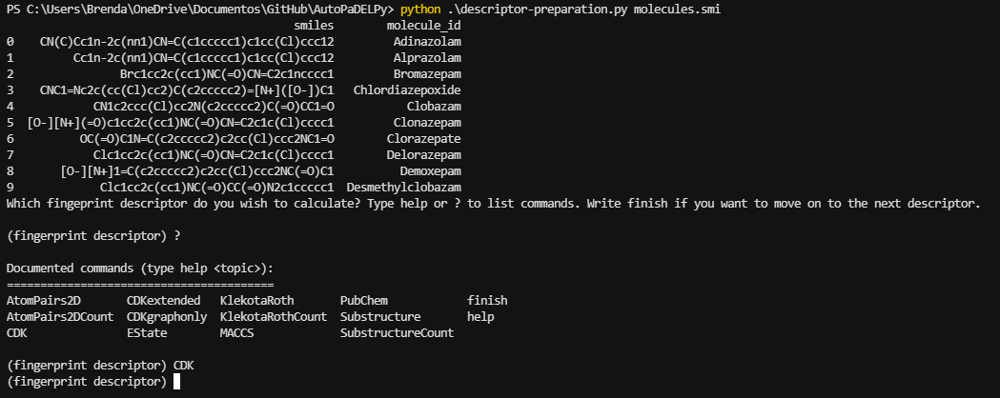
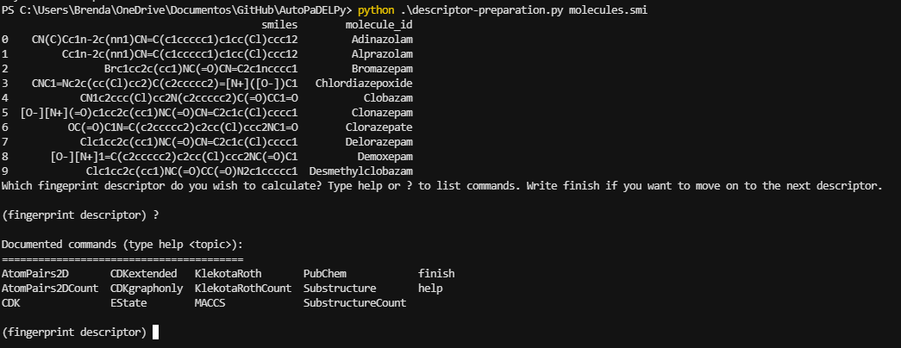
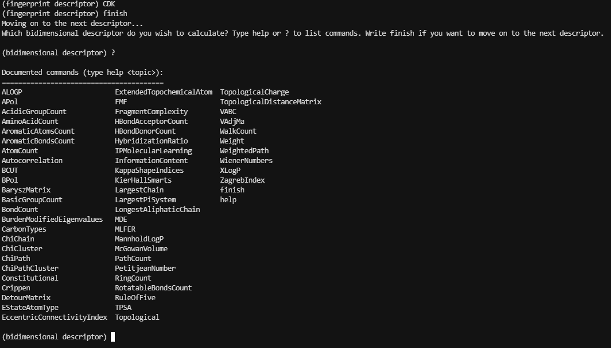
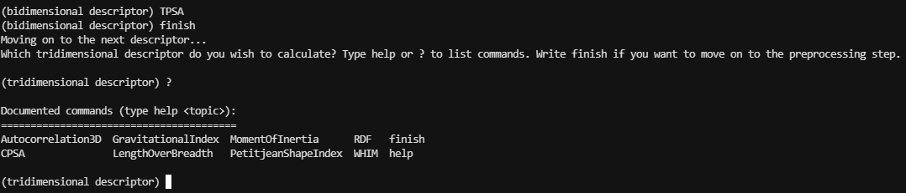

# AutoPaDELPy: An automating tool for PaDELPy software

AutoPaDELPy provides an automated user interface for PaDELPy software. It was created to provide a more friendly interaction with the software for the final user.



---

## Libraries and softwares used

* [PaDELPy](https://github.com/ecrl/padelpy) - PaDELPy provides a Python wrapper for the PaDEL-Descriptor molecular descriptor calculation software. It was created to allow direct access to the PaDEL-Descriptor command-line interface via Python.

* [pandas](https://pandas.pydata.org/) - a Python package that provides fast, flexible, and expressive data structures designed to make working with "relational" or "labeled" data both easy and intuitive. 

### **Instalation**


PaDELPy:
```
pip install padelpy
```

pandas:
```
pip install pandas
```


## How to use

* Download the code and unzip it on the desirable directory

To run use the following command:
```
python descriptor-preparation.py resources/molecules.smi
```

**molecules.smi is the input, you may change to use for your own datasets.**

* Your dataset **need** to have the format 'smiles,molecule_id'

* First you are going to choose the fingeprint descriptor. You can choose more than one but just one at time.



* Then, you are going to choose the bidimensional descriptor. You can also choose more than one but just one at time.



* Finally, you are going to choose the tridimensional descriptor. You can also choose more than one but just one at time.



* Now, the software is going to wrap up the information. You can access it at the output_files folder.


## Obervations:

**This software was written as an automating tool for PaDELPy, as allowed by the MIT license for PaDELPy. Please refer to them at [PaDELPy](https://github.com/ecrl/padelpy)**

**Some of the codes used to build the functions in this software was adapted from [Data Professor PaDELPy tutorial](https://github.com/dataprofessor/padel). If you want to learn more about the software please refer to [PaDELPy tutorial](https://www.youtube.com/watch?v=rEmDyZHz5U8&ab_channel=DataProfessor)**

## Authorship

* Author: **Brenda Ferrari** ([brendaferrari](https://github.com/brendaferrari))
* Review: **Lucas Bertoncello** ([lbertoncello](https://github.com/lbertoncello))

Social preview original photo by **Brenda Ferrari** ([brendaferrari](https://github.com/brendaferrari))